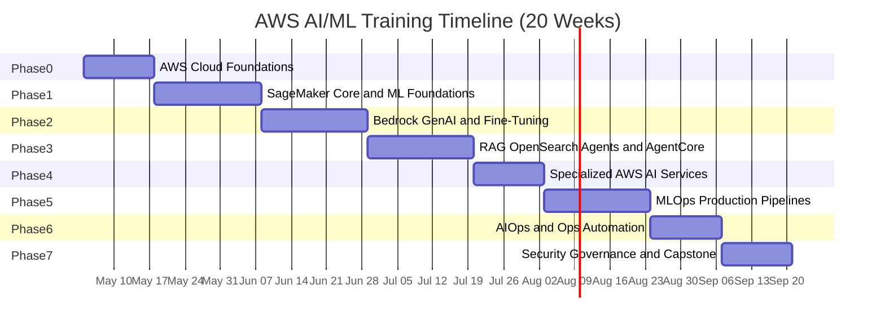

# AWS AI/ML Architect Training Plan

## Goal

Upskill the team from AI practitioners to **AWS-native AI architects** with strong depth across the entire AWS AI/ML ecosystem, enabling them to make informed technology decisions, understand service capabilities and limitations, handle real-world constraints, and deliver production-grade solutions.

---

## AWS Services Coverage Map

The following table maps every AWS AI/ML service in scope to the training phase where it is covered. No service is left out.

- **Phase 0 -- AWS Cloud Foundations:** EC2, ELB, ASG, VPC, S3, IAM (deep), RDS/Aurora, DynamoDB, Lambda, API Gateway, ECS/ECR/EKS, CloudFront, Route 53, CloudWatch, CloudTrail, KMS, Secrets Manager, CloudFormation, Step Functions, SQS/SNS/Kinesis, Athena, Glue, Redshift, EMR, Lake Formation, and overview of ML services (Rekognition, Textract, Comprehend, Lex, Polly, Transcribe, Personalize, SageMaker)
- **Phase 1 -- SageMaker Core:** SageMaker (Studio, Autopilot, Canvas, Data Wrangler, JumpStart, Feature Store, Ground Truth), S3, EC2, IAM basics
- **Phase 2 -- Bedrock & GenAI:** Bedrock (Claude, Titan, Mistral, LLaMA), Bedrock Guardrails, Bedrock Playground, Lambda, API Gateway, SageMaker JumpStart (fine-tuning)
- **Phase 3 -- RAG & Agents:** Bedrock Agents (multi-agent orchestration), Bedrock Knowledge Bases, Bedrock AgentCore (Runtime, Observability, Memory, Identity, Gateway), OpenSearch Serverless, Titan Embeddings, pgvector, DynamoDB, Step Functions, Lambda
- **Phase 4 -- Specialized AI Services:** Textract, Comprehend, Lex, Rekognition, Transcribe, Polly, Personalize, Amazon Q Developer
- **Phase 5 -- MLOps:** SageMaker Pipelines, SageMaker Experiments, Model Registry, Model Monitor, SageMaker Debugger, CodePipeline, CodeBuild, ECR, Docker, CloudFormation/CDK
- **Phase 6 -- AIOps & Ops Automation:** DevOps Guru, CloudWatch (Anomaly Detection), X-Ray (Insights), Systems Manager Automation, Lambda, Step Functions, SNS, EventBridge
- **Phase 7 -- Security, Governance & Capstone:** IAM, KMS, Secrets Manager, CloudTrail, AWS Config, Macie, GuardDuty, Control Tower, SageMaker Clarify, ECS/EKS, App Runner, Cost Explorer, Budgets, Trusted Advisor

**Deployment patterns covered across phases:** Real-time Inference (SageMaker Endpoints), Batch Inference (Batch Transform), Multi-model Serving (Multi-model Endpoints), Serverless Inference (Lambda + Bedrock)

---

## Training Structure

- **Duration:** 20 weeks (5 months)
- **Format:** Self-paced Udemy courses + free AWS/Coursera resources + weekly PoC labs
- **Cadence:** Each phase = 2-3 weeks. Weekly sync for Q&A and progress review.
- **Enablement Levels**:
  - Level 1: Awareness -- Q&A sessions, talks, tool deep dives (weekly, then bi-weekly)
  - Level 2: Hands-On -- PoC development per phase (per pod capacity)
  - Level 3: Production-Readiness -- Pilot to MVP transitions (as use cases mature)

---

## Phase 0: AWS Cloud Foundations (Weeks 1-2)

### Objective

Establish a solid AWS infrastructure baseline for the entire team. While the team are AI practitioners, architecting production-grade AI/ML solutions requires deep fluency in core AWS services -- networking (VPC, subnets, security groups), compute (EC2, ECS, Lambda), storage (S3, EBS, EFS), databases (RDS, DynamoDB), security (IAM policies/roles, KMS, Secrets Manager), and infrastructure-as-code (CloudFormation). This phase ensures everyone starts from the same foundation before diving into AI/ML-specific services.

### Udemy Course

**Ultimate AWS Certified Solutions Architect Associate (SAA-C03) [2026]** by Stephane Maarek
- Rating: 4.7 (234,000+ ratings), 1,000,000+ students, ~27 hrs, continuously updated
- Link: https://www.udemy.com/course/aws-certified-solutions-architect-associate-saa-c03/
- Covers: IAM (deep), EC2, ELB, ASG, S3, CloudFront, RDS/Aurora, ElastiCache, DynamoDB, Lambda, API Gateway, ECS/ECR/EKS/Fargate, Route 53, VPC (subnets, NAT, NACL, security groups, VPN, Direct Connect), CloudWatch, CloudTrail, KMS, Secrets Manager, SSM Parameter Store, CloudFormation, Step Functions, SQS/SNS/Kinesis, Athena, Glue, Redshift, EMR, Lake Formation, and overview of ML services (Rekognition, Textract, Comprehend, Lex, Polly, Transcribe, Personalize, SageMaker). The most comprehensive single-course coverage of AWS core infrastructure available on Udemy.
- **Approach:** Focus on Sections 3-22 (core infrastructure) over 2 weeks. Skip exam-prep sections. The ML services overview (Sections 23-24) provides a preview of Phases 1-4.

### Free Supplementary

- **AWS Skill Builder (free):** "AWS Cloud Practitioner Essentials" -- https://explore.skillbuilder.aws/learn/course/134/aws-cloud-practitioner-essentials (6 hrs, official AWS foundational course for quick reference)

### PoC: Cloud-Native Infrastructure Setup

**Goal:** Establish the reusable AWS infrastructure foundation that all subsequent PoCs will build upon.

**Build steps:**
1. Create a VPC with public/private subnets, NAT Gateway, and security groups following AWS best practices
2. Set up IAM roles with least-privilege policies for SageMaker, Bedrock, Lambda, ECS, and Step Functions
3. Configure S3 buckets with versioning, lifecycle policies, and KMS encryption for ML data and model artifacts
4. Deploy a DynamoDB table (used as audit log/metadata store across future PoCs)
5. Set up a CloudWatch Log Group structure and basic CloudWatch dashboard
6. Define all resources via CloudFormation/CDK template (reused and extended in later phases)
7. Configure AWS Budgets alarm for the sandbox account

**AWS Services:** VPC, IAM, S3, KMS, DynamoDB, CloudWatch, CloudFormation/CDK, Budgets

---

## Phase 1: SageMaker Core and ML Foundations (Weeks 3-5)

### Objective

Master SageMaker end-to-end: Studio, built-in algorithms, training jobs, hyperparameter tuning, endpoint deployment, Feature Store, Ground Truth (data labeling), Canvas (no-code), Data Wrangler, and JumpStart.

### Udemy Course

**AWS Machine Learning with SageMaker: Hands-On** by Chandra Lingam
- Rating: 4.5 (4,249 ratings), 39,714 students, ~19.5 hrs, updated April 2026
- Link: https://www.udemy.com/course/aws-machine-learning-a-complete-guide-with-python/
- Covers: SageMaker Studio, built-in algorithms (XGBoost, Linear Learner, PCA, KNN), model training/tuning/deployment, Canvas/Data Wrangler/Autopilot (no-code/low-code), Hugging Face + DeepSeek LLMs on SageMaker, A/B testing, zero-downtime deployment, model explainability (SageMaker Clarify intro), and maps to MLS-C01 certification

### Free Supplementary

- **Coursera (free audit):** "AWS: ML Workflows with SageMaker, Storage & Security" -- https://www.coursera.org/learn/aws-ml-workflows-with-sagemaker-storage--security (covers SageMaker, S3, Kinesis, Redshift, IAM, KMS for ML)

### PoC: Fraud and Anomaly Detection Pipeline

**Goal:** Detect financial irregularities using logs + anomaly detection + LLMs.

**What makes this unique:** Goes beyond a simple classifier -- combines SageMaker's built-in Random Cut Forest (unsupervised anomaly detection) with a supervised XGBoost fraud classifier, then layers a Bedrock LLM to generate human-readable explanations of flagged transactions.

**Build steps:**
1. Ingest a transaction dataset into S3, register features in SageMaker Feature Store
2. Label a subset using SageMaker Ground Truth with a private workforce
3. Train an unsupervised Random Cut Forest model for anomaly scoring
4. Train a supervised XGBoost classifier for fraud probability
5. Combine both model outputs in an inference pipeline (SageMaker Serial Inference Pipeline)
6. Deploy as a real-time SageMaker Endpoint with Model Monitor for data drift
7. Add a Lambda function that passes flagged transactions to Bedrock (Claude) for natural-language explanation
8. Expose via API Gateway; CloudWatch dashboard for real-time metrics

**AWS Services:** SageMaker (Studio, Feature Store, Ground Truth, Endpoints, Model Monitor, Inference Pipeline), S3, Lambda, API Gateway, Bedrock, CloudWatch

---

## Phase 2: Generative AI, Amazon Bedrock and Fine-Tuning (Weeks 6-8)

### Objective

Master Amazon Bedrock end-to-end: foundation model access (Claude, Titan, Mistral, LLaMA), prompt engineering, prompt management/versioning, fine-tuning, reinforcement fine-tuning (RFT), Bedrock Guardrails, batch inference, image generation (Stability AI), serverless GenAI deployment (Lambda + API Gateway), and Bedrock Data Automation.

### Udemy Course

**[2026] Complete AWS Bedrock Generative AI Course + Projects** by Patrik Szepesi
- Rating: 4.5 (5,921 ratings), 15,012 students, ~14.5 hrs, updated March 2026
- Link: https://www.udemy.com/course/complete-aws-bedrock-generative-ai-course-projects/
- Covers: Bedrock foundations, LLM concepts, prompt management/optimization, fine-tuning + RFT, batch inference, image generation (diffusion models), LLM evaluation (Bedrock Evaluator), AI watermark detection, serverless deployment (Lambda + API Gateway + S3), multi-agent workflows, AgentCore deployment, voice agents (Nova Sonic), agent memory (short-term + long-term), Strands Agents framework. Includes 6 projects.

### Free Supplementary

- **Coursera (free audit):** "Generative AI Applications with Amazon Bedrock" by AWS -- https://www.coursera.org/learn/generative-ai-applications-amazon-bedrock (Knowledge Bases, Agent orchestration, RAG, prompt engineering, ~8 hrs)

### PoC: Fine-Tuned Foundation Model for Healthcare Compliance

**Goal:** Adapt a base model to domain-specific tasks -- healthcare compliance.

**What makes this unique:** Combines Bedrock custom model training with Guardrails for regulated-industry safety, Bedrock Evaluator for measuring improvement, and a full serverless deployment stack.

**Build steps:**
1. Curate a healthcare compliance Q&A dataset (HIPAA regulations, clinical guidelines, compliance scenarios)
2. Fine-tune Amazon Titan Text using Bedrock's custom model training with the prepared dataset
3. Run Bedrock Evaluator to compare fine-tuned model vs base model on domain accuracy
4. Apply Reinforcement Fine-Tuning (RFT) with human preference data to further improve responses
5. Configure Bedrock Guardrails: block PHI leakage, enforce response grounding, deny off-topic queries
6. Deploy via serverless stack: API Gateway -> Lambda -> Bedrock fine-tuned model
7. Build a Streamlit front-end for interactive compliance Q&A with citation display
8. Use Bedrock Batch Inference to generate compliance reports across document batches

**AWS Services:** Bedrock (Custom Models, Fine-Tuning, RFT, Guardrails, Evaluator, Batch Inference), Lambda, API Gateway, S3, CloudWatch

---

## Phase 3: RAG, OpenSearch, Multi-Agent Systems and AgentCore (Weeks 9-11)

### Objective

Build production-grade RAG pipelines using Bedrock Knowledge Bases and OpenSearch vector search. Orchestrate multi-agent LLM workflows with Bedrock Agents including supervisor mode, tool calling, human-in-the-loop, CrewAI integration, and MCP. Deploy, scale, and monitor agents in production using Bedrock AgentCore (Runtime, Observability, Memory, Identity, Gateway).

### Udemy Courses

**Course A: AI & ML Search with OpenSearch** by Pradeep Macharla
- Rating: 3.9 (37 ratings), 414 students, ~17.5 hrs, updated January 2026
- Link: https://www.udemy.com/course/ai-ml-search-with-opensearch/
- Covers: OpenSearch installation/configuration, traditional + neural + hybrid search, k-NN vector search, semantic search, RAG pipelines with local/external LLMs, agentic workflows, OpenSearch Dashboards/observability, Elasticsearch migration.

**Course B: Build Production Ready AI Agents on AWS -- Bedrock, CrewAI & MCP** by Rahul Trisal
- Rating: 4.6 (1,561 ratings), 7,729 students, ~9.5 hrs, updated March 2026
- Link: https://www.udemy.com/course/aws-ai-agents-complete-course-hands-on/
- Covers: AI Agent fundamentals (planning, tools, memory, multi-agent), Bedrock Agents deep dive, multi-agent orchestration framework, 4 use cases (hotel booking agent, enterprise travel multi-agent, CrewAI vacation planner, MCP infra coding agent), Bedrock Knowledge Bases integration

**Course C: Amazon Bedrock AgentCore: Build & Deploy any AI Agent on AWS** by Rahul Trisal
- Rating: 4.6, ~4 hrs, updated 2026
- Link: https://www.udemy.com/course/amazon-bedrock-agentcore-build-ai-agents-on-aws-hands-on/
- Covers: AgentCore Runtime (deploy agents from any framework -- LangGraph, CrewAI, custom -- as managed infrastructure), AgentCore Observability (trace/debug agent execution), AgentCore Memory (short-term + long-term context), AgentCore Identity (OAuth, IAM-based auth for tool access), AgentCore Gateway (API management for agent endpoints). Hands-on labs. This is the missing production-deployment piece: Course B teaches building agents, Course C teaches deploying and operating them at scale.

### Free Supplementary

- **DEV Community (free):** "Amazon Bedrock for Beginners: From First Prompt to AI Agent" -- https://dev.to/morganwilliscloud/amazon-bedrock-for-beginners-from-first-prompt-to-ai-agent-full-tutorial-12ln (full tutorial with code, covers Converse API, tool use, RAG Knowledge Bases, Guardrails, Strands Agents SDK)

### PoC: Agentic AI for Complex Enterprise Workflows with HITL

**Goal:** Orchestrate multi-agent LLM workflows with fallback, confidence scoring, and human-in-the-loop.

**What makes this unique:** This is not a simple chatbot. It implements a multi-agent supervisor pattern with 3 specialized agents, confidence-based routing, HITL approval gates for high-risk actions, and fallback chains.

**Build steps:**
1. Set up OpenSearch Serverless with vector search index (cosine similarity, HNSW)
2. Ingest enterprise policy documents into Bedrock Knowledge Base backed by OpenSearch + Titan Embeddings
3. Create 3 Bedrock Agents with distinct roles:
   - **Policy Research Agent:** Retrieves relevant policy sections via RAG (Knowledge Base)
   - **Compliance Assessment Agent:** Evaluates user queries against retrieved policies, generates compliance scores
   - **Action Recommendation Agent:** Suggests remediation steps with risk-level classification
4. Build a Supervisor Agent (Bedrock multi-agent orchestration) that routes queries to the appropriate sub-agent based on intent classification
5. Implement confidence scoring: if compliance score < threshold, escalate to HITL
6. Configure Bedrock's built-in HITL confirmation for high-risk recommendations (approval gates via Lambda + SNS)
7. Add Step Functions orchestration for fallback: if primary agent fails, route to secondary agent with different model
8. Store conversation history and audit trail in DynamoDB
9. Deploy the multi-agent system to production using Bedrock AgentCore:
   - AgentCore Runtime: deploy agents as managed infrastructure with auto-scaling
   - AgentCore Observability: enable tracing/debugging of agent execution chains
   - AgentCore Memory: configure long-term memory for cross-session context retention
   - AgentCore Identity: set up OAuth-based tool access controls
   - AgentCore Gateway: expose agent endpoints via managed API gateway
10. Deploy front-end via Streamlit showing agent reasoning chain, confidence scores, and HITL approval UI

**AWS Services:** Bedrock Agents (multi-agent orchestration, HITL), Bedrock AgentCore (Runtime, Observability, Memory, Identity, Gateway), Bedrock Knowledge Bases, OpenSearch Serverless, Titan Embeddings, Lambda, Step Functions, DynamoDB, SNS, S3

---

## Phase 4: Specialized AWS AI Services -- Vision, NLP, Speech, Recommendations (Weeks 12-13)

### Objective

Gain hands-on depth in purpose-built AWS AI services: Textract (document OCR), Comprehend (NLP), Lex (conversational AI), Rekognition (computer vision), Transcribe (speech-to-text), Polly (text-to-speech), Personalize (recommendations), and Amazon Q Developer (coding assistant).

### Udemy Course

**Generative AI on AWS -- Amazon Bedrock, RAG & Langchain [2026]** by Rahul Trisal
- Rating: 4.5 (7,222 ratings), 32,345 students, ~12 hrs, updated March 2026
- Link: https://www.udemy.com/course/amazon-bedrock-aws-generative-ai-beginner-to-advanced/
- Covers: 7 hands-on use cases including text summarization (Cohere FM), chatbot (DeepSeek + Langchain + Streamlit), RAG with FAISS, serverless e-learning app (Knowledge Base + Lambda + API Gateway), retail banking agent (Bedrock Agents + Knowledge Bases + DynamoDB), infrastructure coding agent (Amazon Q CLI + CloudFormation MCP). Provides breadth across multiple AWS AI services.

### Free Supplementary (one per service -- all verified)

- **Coursera (free audit):** "Getting Started with Amazon Textract" by AWS -- https://www.coursera.org/learn/aws-getting-started-with-amazon-textract (~1 hr, hands-on demo)
- **Coursera (free audit):** "Getting Started with Amazon Personalize" by AWS -- https://www.coursera.org/learn/aws-getting-started-with-amazon-personalize (~1 hr, build a movie recommendation engine)
- **DEV Community (free):** "Machine Learning 101 with AWS" -- https://dev.to/leonardkachi/machine-learning-101-with-aws-164k (comprehensive guide covering Comprehend, Lex, Polly, Rekognition, Textract, Transcribe, Translate, Forecast, Fraud Detector, SageMaker with architecture patterns)

### PoC A: Intelligent Document Processing & Automation

**Goal:** AI-based understanding of invoices, contracts, and forms.

**What makes this unique:** End-to-end document intelligence pipeline combining OCR, NLP entity extraction, PII detection, and conversational querying -- not just text extraction.

**Build steps:**
1. Upload scanned invoices/contracts/forms to S3
2. Amazon Textract: Extract text, tables, key-value pairs, and signatures from documents
3. Amazon Comprehend: Run entity extraction (dates, amounts, organizations) + PII detection (SSNs, account numbers)
4. Amazon Comprehend Custom: Train a custom entity recognizer for domain-specific entities (e.g., clause types in contracts)
5. Store structured extracted data in DynamoDB with document metadata
6. Build a Step Functions workflow: S3 trigger -> Textract -> Comprehend -> validation -> human review (if PII detected) -> DynamoDB storage
7. Add Amazon Lex chatbot: allow users to query extracted document data conversationally ("What is the total on invoice #123?")
8. Amazon Polly: Read back document summaries via text-to-speech for accessibility
9. Front-end: Streamlit app with document upload, extraction preview, entity highlighting, and Lex chat interface

**AWS Services:** Textract, Comprehend (built-in + custom), Lex, Polly, DynamoDB, Step Functions, Lambda, S3

### PoC B: Hyper-Personalized Customer Experience Engine

**Goal:** Build a recommendation engine with real-time hyper-personalization using contextual metadata.

**What makes this unique:** Goes beyond basic recommendations -- adds real-time context (device, time-of-day, location) and Rekognition-based visual similarity for product images.

**Build steps:**
1. Prepare user-item interaction dataset + item metadata (category, price, images)
2. Create Amazon Personalize Dataset Group, import interactions + items + users datasets
3. Train a User-Personalization solution with contextual metadata (time, device, location)
4. Create a Campaign for real-time recommendations + a Batch Inference job for email campaigns
5. Use Amazon Rekognition to detect labels/categories in product images; feed as item features into Personalize
6. Build an API (Lambda + API Gateway) that takes user context and returns personalized recommendations
7. Implement real-time event tracking via Personalize Event Tracker (PutEvents API) for session-based personalization
8. Front-end: Streamlit e-commerce mockup showing personalized homepage, "similar items" (Rekognition visual similarity), and contextual re-ranking

**AWS Services:** Personalize (real-time + batch + event tracking), Rekognition, Lambda, API Gateway, S3

---

## Phase 5: MLOps and Production Pipelines (Weeks 14-16)

### Objective

Master end-to-end ML lifecycle: SageMaker Pipelines, Experiments, Model Registry with approval workflows, Model Monitor (data/model quality/bias/explainability), CI/CD for ML (CodePipeline + CodeBuild), containerized deployment (ECR, ECS/EKS), and infrastructure-as-code (CDK/CloudFormation).

### Udemy Course

**MLOps with AWS -- Bootcamp -- Zero to Hero Series** by Manifold AI Learning
- Rating: 4.5 (1,145 ratings), 10,644 students, ~38 hrs, updated November 2025
- Link: https://www.udemy.com/course/practical-mlops-for-data-scientists-devops-engineers-aws/
- Covers: MLOps concepts, DevOps for data scientists, AWS CodeCommit/CodeBuild/CodeDeploy/CodePipeline, Docker containers, ECR, SageMaker (Studio, Feature Engineering, Pipelines, Endpoints), model deployment/monitoring/drift detection, load testing, Athena, Batch, EC2, Lambda, CloudWatch, S3. 23 sections, 187 lectures.

### Free Supplementary

- **Coursera (free audit):** "AWS: ML Workflows with SageMaker, Storage & Security" -- https://www.coursera.org/learn/aws-ml-workflows-with-sagemaker-storage--security (covers SageMaker Pipelines, Model Registry, IAM for ML, KMS, Secrets Manager, Macie, CloudWatch monitoring)

### PoC: Production ML Pipeline with Drift-Triggered Auto-Retraining

**Goal:** Build a production-grade, fully automated ML pipeline that detects drift and auto-retrains -- demonstrating the SageMaker Pipelines + CodePipeline + Model Registry + Model Monitor stack.

**What makes this unique:** Not a manual retrain-and-deploy demo. This is a closed-loop system: Model Monitor detects drift -> CloudWatch alarm fires -> EventBridge triggers CodePipeline -> SageMaker Pipeline retrains -> new model registered -> human approval in Model Registry -> auto-deploy to production endpoint with A/B traffic routing.

**Build steps:**
1. Create a SageMaker Pipeline: DataProcessing (Processing Job) -> Training (XGBoost) -> Evaluation -> Conditional (accuracy threshold) -> RegisterModel
2. Set up SageMaker Experiments to track hyperparameters, metrics, and artifacts across runs
3. Register model in SageMaker Model Registry with "PendingApproval" status
4. Configure SageMaker Model Monitor: data quality monitor + model quality monitor on the production endpoint
5. Set up CloudWatch alarm on drift metric; EventBridge rule triggers CodePipeline on alarm
6. CodePipeline: CodeBuild step runs SageMaker Pipeline -> waits for model approval -> CodeDeploy updates SageMaker Endpoint
7. Deploy with production variant routing: 90% traffic to current model, 10% to new (A/B test)
8. Build CloudWatch dashboard: endpoint latency, invocation count, data drift score, model accuracy over time
9. Infrastructure-as-code: entire stack defined in AWS CDK (Python)

**AWS Services:** SageMaker (Pipelines, Experiments, Model Registry, Model Monitor, Endpoints, Processing Jobs), CodePipeline, CodeBuild, ECR, EventBridge, CloudWatch, SNS, CDK, S3

---

## Phase 6: AIOps and Ops Automation (Weeks 17-18)

### Objective

Implement AI-driven infrastructure monitoring (AIOps) using DevOps Guru, CloudWatch Anomaly Detection, and X-Ray Insights. Build predictive runbook automation with Systems Manager and Step Functions.

### Udemy Course

**AWS Lambda & Serverless Architecture Bootcamp** by Riyaz Sayyad
- Rating: 4.0 (5,886 ratings), 50,339 students, ~6 hrs, updated September 2025
- Link: https://www.udemy.com/course/aws-lambda-serverless-architecture/
- Covers: Lambda (triggers, VPC, Layers, container packaging), API Gateway (staging, auth, throttling), DynamoDB deep-dive, Step Functions orchestration, EventBridge/SQS/SNS event-driven patterns, SAM, observability, CI/CD. Provides the serverless and orchestration foundation needed for AIOps automation.

### Free Supplementary (core AIOps content)

- **Coursera (free audit, by AWS):** "DevOps and AI on AWS: AIOps" -- https://www.coursera.org/learn/aiops-aws (~6 hrs. Covers AIOps fundamentals, CloudWatch Anomaly Detection, X-Ray Insights, DevOps Guru, Amazon Q Developer security scanning. Created by AWS instructors Russell Sayers and Morgan Willis. Part of the "DevOps and AI on AWS" Specialization.)

### PoC A: Proactive Infrastructure Monitoring with AIOps

**Goal:** Detect overload and auto-heal infrastructure using AI-driven monitoring.

**What makes this unique:** Combines 3 AWS AIOps services (DevOps Guru, CloudWatch Anomaly Detection, X-Ray Insights) into a single monitoring solution that detects issues before they become outages, then auto-remediates.

**Build steps:**
1. Deploy a sample multi-tier application on ECS Fargate (front-end + API + DynamoDB) to serve as the monitored workload
2. Enable Amazon DevOps Guru on the application stack: it uses ML to detect anomalous operational behavior and generate insights
3. Configure CloudWatch Anomaly Detection on key metrics (CPU, memory, request latency, error rates) -- let ML establish dynamic thresholds
4. Enable AWS X-Ray tracing across the application; configure X-Ray Insights to detect anomalies in trace data
5. Create a unified CloudWatch dashboard showing: DevOps Guru insights, anomaly detection bands, X-Ray service map with latency distribution
6. Set up EventBridge rules: when DevOps Guru generates a "reactive insight" or CloudWatch anomaly alarm fires, trigger a Step Functions workflow
7. The Step Functions workflow: assess severity -> if high, auto-scale ECS tasks (via ECS UpdateService API) -> send SNS notification -> log remediation action to DynamoDB
8. If remediation fails after retry, escalate to PagerDuty/Slack via SNS + Lambda

**AWS Services:** DevOps Guru, CloudWatch (Anomaly Detection, dashboards, alarms), X-Ray (Insights), ECS Fargate, Step Functions, EventBridge, Lambda, SNS, DynamoDB

### PoC B: Predictive Runbook Automation

**Goal:** Implement predictive remediation with ML triggers using AWS Systems Manager.

**What makes this unique:** Not just reactive -- uses CloudWatch anomaly predictions to trigger Systems Manager Automation runbooks *before* failure occurs.

**Build steps:**
1. Create 3 Systems Manager Automation runbooks for common remediation:
   - Restart unhealthy ECS tasks
   - Flush and resize DynamoDB read/write capacity
   - Rotate secrets via Secrets Manager on security anomaly
2. Configure CloudWatch Anomaly Detection on infrastructure metrics with "predictive" mode (anomaly band forecasting)
3. Set up EventBridge rules: when predicted anomaly crosses threshold (before actual breach), trigger the appropriate SSM Automation runbook
4. Each runbook logs its actions to CloudWatch Logs and sends status to an SNS topic
5. Build a "Runbook Execution Dashboard" in CloudWatch: remediation count by type, success/failure rate, MTTR (mean time to remediate)
6. Add human-approval gate for destructive runbooks (e.g., restart) using SSM Automation approval action

**AWS Services:** Systems Manager Automation, CloudWatch (Anomaly Detection, Logs), EventBridge, Lambda, Step Functions, SNS, Secrets Manager, ECS

---

## Phase 7: Security, Governance, Responsible AI and Capstone (Weeks 19-20)

### Objective

Secure AI/ML workloads using IAM, KMS, Secrets Manager, CloudTrail, AWS Config, Macie, and GuardDuty. Implement responsible AI with SageMaker Clarify (bias detection + explainability). Deliver a capstone PoC integrating multiple phases.

### Udemy Course

**Ultimate AWS Certified Security Specialty [2026] SCS-C03** by Stephane Maarek (selective sections)
- Rating: 4.7 (7,407 ratings), 65,682 students, ~17 hrs, updated March 2026
- Link: https://www.udemy.com/course/ultimate-aws-certified-security-specialty/
- **Selective sections:** Domain 1 (Detection -- GuardDuty, Config, CloudTrail), Domain 4 (IAM -- policies, roles, permission boundaries, cross-account), Domain 5 (Data Protection -- KMS, Secrets Manager, Macie, encryption), Domain 6 (Security Foundations & Governance -- Control Tower, Organizations, Security Hub)

### Free Supplementary

- **Coursera (free audit):** "AWS: ML Workflows with SageMaker, Storage & Security" Module 3 -- https://www.coursera.org/learn/aws-ml-workflows-with-sagemaker-storage--security (covers IAM for ML, KMS encryption, Secrets Manager, WAF/Shield, Macie for S3, Trusted Advisor)
- **AWS Security Blog (free):** "Secure AI Agent Access Patterns Using MCP" -- https://aws.amazon.com/blogs/security/secure-ai-agent-access-patterns-to-aws-resources-using-model-context-protocol/ (3 principles for IAM controls on AI agents, published April 2026)

### PoC: Capstone -- Secure End-to-End AI Application for Gen AI Development Assistance

**Goal:** Build a production-grade, secure Gen AI coding assistant platform for internal developer use while demonstrating security, governance, and responsible AI practices from Phase 7.

**What makes this unique:** This capstone integrates learnings from every phase into a single deployable solution -- RAG-augmented code generation, multi-agent architecture, MLOps deployment, AIOps monitoring, and full security/governance hardening. It is NOT a generic chatbot; it is a governed, auditable, enterprise-grade platform.

**Build steps:**
1. **RAG Pipeline (Phase 3):** Ingest internal codebase documentation, API specs, and coding standards into Bedrock Knowledge Base (OpenSearch + Titan Embeddings)
2. **Multi-Agent System (Phase 3):** Build 3 Bedrock Agents:
   - Code Generation Agent: generates code snippets from natural language, grounded in internal docs via RAG
   - Code Review Agent: reviews generated code for security vulnerabilities and coding standards compliance
   - Test Generation Agent: generates unit tests for the produced code
3. **Supervisor Orchestration (Phase 3):** Bedrock multi-agent supervisor routes user request -> Code Gen -> Code Review -> Test Gen -> combined response
4. **Fine-Tuned Model (Phase 2):** Fine-tune Titan on internal code patterns for better code generation accuracy
5. **Responsible AI (Phase 7):** SageMaker Clarify for bias detection (e.g., does the model favor certain languages/frameworks unfairly?); Bedrock Guardrails to block generation of insecure code patterns (SQL injection, hardcoded secrets)
6. **Security Hardening (Phase 7):**
   - IAM: Least-privilege roles per agent, SCP to prevent Bedrock model access outside approved models
   - KMS: Encrypt Knowledge Base data, DynamoDB audit logs, S3 artifacts at rest
   - Secrets Manager: Store API keys, rotate automatically
   - CloudTrail: Log all Bedrock API calls, agent invocations
   - Macie: Scan S3 buckets for accidentally uploaded credentials/PII
   - GuardDuty: Monitor for anomalous API access patterns
7. **MLOps Deployment (Phase 5):** CDK stack for entire infrastructure; CodePipeline for CI/CD of agent configurations
8. **AIOps Monitoring (Phase 6):** CloudWatch dashboards for agent response latency, token usage, error rates; DevOps Guru enabled; X-Ray tracing across the agent chain
9. **Front-end:** Deployed on ECS Fargate, accessible via internal ALB with WAF
10. **Cost Governance:** Tag all resources; Cost Explorer + Budgets alert when monthly spend exceeds threshold

**AWS Services (comprehensive cross-phase integration):** Bedrock (Agents, Knowledge Bases, Guardrails, Custom Models, AgentCore), SageMaker (Clarify), OpenSearch Serverless, Titan Embeddings, Lambda, API Gateway, Step Functions, DynamoDB, ECS Fargate, ALB, WAF, IAM, KMS, Secrets Manager, CloudTrail, Macie, GuardDuty, Config, CloudWatch, X-Ray, DevOps Guru, CodePipeline, CodeBuild, CDK, SNS, S3, Cost Explorer, Budgets

**Deliverable:** Each team member presents their architecture diagram, security posture review, cost analysis, and lessons learned. Peer review using AWS Well-Architected AI/ML Lens.

---

## Summary: Courses and Investment

| Phase | Udemy Course | Hours | Verified Link |
|---|---|---|---|
| 0 | Ultimate AWS SAA-C03 [2026] (Stephane Maarek) | ~27 hrs | https://www.udemy.com/course/aws-certified-solutions-architect-associate-saa-c03/ |
| 1 | AWS ML with SageMaker: Hands-On (Chandra Lingam) | ~19.5 hrs | https://www.udemy.com/course/aws-machine-learning-a-complete-guide-with-python/ |
| 2 | [2026] Complete AWS Bedrock GenAI Course + Projects (Patrik Szepesi) | ~14.5 hrs | https://www.udemy.com/course/complete-aws-bedrock-generative-ai-course-projects/ |
| 3a | AI & ML Search with OpenSearch (Pradeep Macharla) | ~17.5 hrs | https://www.udemy.com/course/ai-ml-search-with-opensearch/ |
| 3b | Build Production Ready AI Agents on AWS (Rahul Trisal) | ~9.5 hrs | https://www.udemy.com/course/aws-ai-agents-complete-course-hands-on/ |
| 3c | Amazon Bedrock AgentCore (Rahul Trisal) | ~4 hrs | https://www.udemy.com/course/amazon-bedrock-agentcore-build-ai-agents-on-aws-hands-on/ |
| 4 | Generative AI on AWS - Bedrock, RAG & Langchain [2026] (Rahul Trisal) | ~12 hrs | https://www.udemy.com/course/amazon-bedrock-aws-generative-ai-beginner-to-advanced/ |
| 5 | MLOps with AWS - Bootcamp Zero to Hero (Manifold AI Learning) | ~38 hrs | https://www.udemy.com/course/practical-mlops-for-data-scientists-devops-engineers-aws/ |
| 6 | AWS Lambda & Serverless Architecture Bootcamp (Riyaz Sayyad) | ~6 hrs | https://www.udemy.com/course/aws-lambda-serverless-architecture/ |
| 7 | Ultimate AWS Security Specialty [2026] SCS-C03 (Stephane Maarek) -- selective | ~17 hrs (selective) | https://www.udemy.com/course/ultimate-aws-certified-security-specialty/ |
| **Total** | **10 Udemy courses** | **~165 hrs** | |

**Free resources used across phases (all verified):**

| Resource | Platform | Link |
|---|---|---|
| AWS Cloud Practitioner Essentials | AWS Skill Builder (free) | https://explore.skillbuilder.aws/learn/course/134/aws-cloud-practitioner-essentials |
| AWS: ML Workflows with SageMaker, Storage & Security | Coursera (free audit) | https://www.coursera.org/learn/aws-ml-workflows-with-sagemaker-storage--security |
| Generative AI Applications with Amazon Bedrock | Coursera (free audit) | https://www.coursera.org/learn/generative-ai-applications-amazon-bedrock |
| Getting Started with Amazon Textract | Coursera (free audit) | https://www.coursera.org/learn/aws-getting-started-with-amazon-textract |
| Getting Started with Amazon Personalize | Coursera (free audit) | https://www.coursera.org/learn/aws-getting-started-with-amazon-personalize |
| DevOps and AI on AWS: AIOps | Coursera (free audit) | https://www.coursera.org/learn/aiops-aws |
| Amazon Bedrock Beginners Tutorial | DEV Community (free) | https://dev.to/morganwilliscloud/amazon-bedrock-for-beginners-from-first-prompt-to-ai-agent-full-tutorial-12ln |
| Machine Learning 101 with AWS | DEV Community (free) | https://dev.to/leonardkachi/machine-learning-101-with-aws-164k |
| Secure AI Agent Access Patterns Using MCP | AWS Blog (free) | https://aws.amazon.com/blogs/security/secure-ai-agent-access-patterns-to-aws-resources-using-model-context-protocol/ |

*Udemy courses frequently go on sale at $12-20 each. With a Udemy Business/Team plan, all courses are included.*

---

## PoC Summary

| Phase | PoC | Reference | Key AWS Services |
|---|---|---|---|
| 0 | Cloud-Native Infrastructure Setup | Foundation | VPC, IAM, S3, KMS, DynamoDB, CloudWatch, CDK, Budgets |
| 1 | Fraud & Anomaly Detection Pipeline | Real-world use case | SageMaker, Feature Store, Ground Truth, Model Monitor, Bedrock, Lambda |
| 2 | Fine-Tuned FM for Healthcare Compliance | Real-world use case | Bedrock (Custom Models, RFT, Guardrails, Evaluator, Batch Inference), Lambda |
| 3 | Agentic AI Multi-Agent System with HITL + AgentCore Deploy | Real-world use case | Bedrock Agents (multi-agent, HITL), AgentCore, Knowledge Bases, OpenSearch, Step Functions |
| 4a | Intelligent Document Processing & Automation | Real-world use case | Textract, Comprehend (custom), Lex, Polly, DynamoDB, Step Functions |
| 4b | Hyper-Personalized Customer Experience | Real-world use case | Personalize (real-time + batch + events), Rekognition, Lambda |
| 5 | MLOps Auto-Retrain Pipeline with Drift Detection | MLOps lifecycle | SageMaker Pipelines, Model Registry, Model Monitor, CodePipeline, CDK |
| 6a | AIOps Proactive Infra Monitoring | AIOps use case | DevOps Guru, CloudWatch Anomaly Detection, X-Ray Insights, ECS, Step Functions |
| 6b | Predictive Runbook Automation | Ops automation use case | Systems Manager Automation, CloudWatch, EventBridge, Secrets Manager |
| 7 | Capstone: Secure GenAI Dev Assistant Platform | Capstone (cross-phase) | Bedrock, SageMaker Clarify, OpenSearch, IAM, KMS, Macie, GuardDuty, CDK, DevOps Guru |

---

## Weekly Rhythm

- **Monday-Thursday:** Self-paced Udemy course modules (~2-3 hrs/day)
- **Wednesday:** Mid-week sync -- Q&A, blockers, knowledge sharing (30 min)
- **Friday:** PoC lab session -- hands-on building in AWS sandbox account (3-4 hrs)
- **Bi-weekly:** Level 1 awareness session -- service deep dives, architecture walkthroughs (1 hr)

---

## Assessment and Progression

- **Per Phase:** PoC demo + architecture review + peer feedback
- **Phase 0 Completion:** Solid AWS infrastructure fluency -- can design VPCs, IAM policies, and core service architectures independently
- **Phase 1-2 Completion:** Can independently build and deploy ML/GenAI solutions on AWS
- **Phase 3-4 Completion:** Can architect RAG pipelines, multi-agent systems with production AgentCore deployment, and leverage the full AWS AI service suite
- **Phase 5-6 Completion:** Can build production MLOps pipelines and implement AIOps monitoring and automation
- **Phase 7 Completion:** Qualifies as an **AWS-native AI Architect** -- can make informed technology decisions, design secure/governed/cost-optimized architectures, handle real-world constraints, and deliver production-grade solutions
- **Optional Certification:** AWS Certified Machine Learning Specialty (MLS-C01) or AWS Certified AI Practitioner (AIF-C01)
